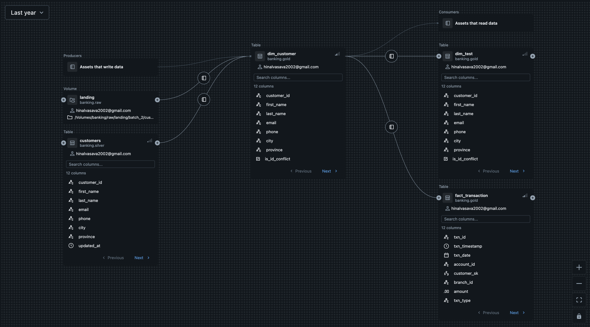

# Governed Banking Lakehouse

A production-shaped data engineering pipeline on Databricks. Raw banking CSVs land in a Unity Catalog Volume, pass through **Bronze → Silver → Gold**, and finish as a governed star schema with **SCD Type 2** history, point-in-time correct fact joins, streaming ingestion, Change Data Capture, and an automated data-quality gate that halts the pipeline on failure.

**Stack** — Databricks (serverless) · PySpark · Delta Lake · Unity Catalog · Spark SQL · Auto Loader · Structured Streaming

**Scale** — 2,000,000 transactions · 7,000 accounts · 5,000+ customers · 3 incremental batches

> Data is synthetic. The engineering patterns, failure modes, and design decisions are real — the generator deliberately injects the data-quality problems that occur in production banking feeds.

---

## Headline result

Regional spend computed two ways — joined to the customer's city **at transaction time** versus their **current** city:

| City | Point-in-time | If overwritten | Difference |
|---|---:|---:|---:|
| Calgary | 15,328,112 | 15,420,520 | +92,408 |
| Halifax | 15,071,866 | 14,919,803 | −152,063 |
| **Montreal** | **14,700,750** | **15,348,946** | **+648,196** |
| Ottawa | 14,624,658 | 14,733,581 | +108,923 |
| **Toronto** | **14,799,011** | **14,437,816** | **−361,195** |
| Vancouver | 14,396,806 | 14,060,537 | −336,269 |

**The differences sum to exactly zero.** Overwriting customer attributes does not lose revenue — it misattributes it between regions while the grand total still reconciles, making the error invisible to total-based validation.

Montreal would be overstated by **$648k (4.4%)** and Toronto understated by **$361k**. Regional budgets would be set on fictional numbers.

This is the concrete business case for SCD Type 2.

---

## Business context

Three consumers, each driving a specific design decision:

| Consumer | Requirement | Design consequence |
|---|---|---|
| **Risk** | Customer attributes *as they were* at transaction time | SCD Type 2 on `dim_customer` |
| **Marketing** | One accurate row per customer (Customer 360) | Deduplication + survivorship rules |
| **Finance** | Monthly spend by region | Point-in-time join on the fact table |

The Risk requirement forced the architecture. Overwriting a customer's city nightly would mean a January transaction in Halifax appears — when reviewed in June — to have happened 4,000km from where the customer "lives." The past gets rewritten, not just forgotten.

---

## Architecture

```
/Volumes/banking/raw/landing/          Unity Catalog Volume
   batch_1/  customers, accounts, transactions, branches
   batch_2/  customers  (500 movers, 200 new)
   batch_3/  customers  (300 movers, 150 new)
   stream/   incremental transaction files  -> Auto Loader
                │
                ▼
┌──────────────────────────────────────────────────────────┐
│ BRONZE   raw as-landed + audit columns                   │
│          ingestion_timestamp · source_file · batch_id    │
│          no cleaning, no dedup, no casting               │
└──────────────────────────────────────────────────────────┘
                │
                ▼
┌──────────────────────────────────────────────────────────┐
│ SILVER   one row per entity · typed · standardised       │
│          dedup (row_number) · ID collisions quarantined  │
│          multi-format date parsing · orphans flagged     │
└──────────────────────────────────────────────────────────┘
                │
                ▼
┌──────────────────────────────────────────────────────────┐
│ GOLD     dim_customer     SCD Type 2, surrogate keys     │
│          fact_transaction point-in-time joined           │
│          daily_txn_counts streaming aggregate            │
└──────────────────────────────────────────────────────────┘
                │
                ▼
          QUALITY GATE — 7 checks, raises on failure
```

### Source schema

```
CUSTOMERS ──< ACCOUNTS >── BRANCHES
                 │
                 └──< TRANSACTIONS
```

| Table | Rows | Grain |
|---|---:|---|
| customers | 5,250 | one per customer version from CRM |
| accounts | 7,000 | one per account |
| transactions | 2,000,000 | one per payment event |
| branches | 12 | reference lookup |

---

## Data quality findings

Every problem below was **discovered by profiling, not assumed** — each has a verification query in the notebook.

| Finding | Volume | Resolution |
|---|---:|---|
| Customer ID collisions | 250 (5%) | Latest kept and flagged; losing row quarantined |
| Orphan transactions | 10,035 (0.5%) | Flagged, retained — likely late-arriving dimension |
| Invalid amounts (≤ 0) | 9,969 (0.5%) | Flagged for consumer filtering |
| Missing emails | 667 (13.3%) | Reported as a metric; empty strings → NULL |
| Mixed date formats | 1,078 (15%) | Multi-format parse, coverage proven at 0 failures |
| Transactions predating first dimension version | 343,936 (17%) | Sentinel `valid_from` on initial load |
| Duplication after checkpoint deletion | 4,000 (2×) | Demonstrated and reset — checkpoint is critical state |
| Events beyond the watermark | 200 | Routed to a late-events side table |

---

## Engineering decisions

**Flag, don't drop.** 10,035 transactions referenced accounts that don't exist. Dropping them would be permanent — but accounts and transactions arrive from different systems on different schedules, so most orphans are *late-arriving dimensions*, not corrupt data. They're retained with `is_orphan = true`, and the orphan **rate** is monitored: a jump from 0.5% to 20% means the accounts feed broke, not that customer behaviour changed.

**Survivorship requires confirmed identity.** The standard fix for a missing field is to borrow it from an older duplicate row. Here, all 250 duplicate IDs carried *different names* — two people sharing an identifier, not one person updated twice. Borrowing an email across that boundary would fabricate a customer who doesn't exist. No survivorship was applied; the losing rows were quarantined instead of deleted, and row counts reconcile: 4,750 + 250 + 250 = 5,250.

**Never invent values.** 667 customers have no email. They stay NULL. `'unknown'` looks like data, defeats null checks, and hides the gap. NULL is the honest answer, and the 13.3% becomes a metric Marketing can act on.

**Prove, don't assume.** Two date formats were visible in the data — but visible isn't exhaustive. Parsing with both and counting rows where *text existed but nothing parsed* returned zero, proving coverage. The same before/after pattern verified numeric casts, join completeness, and the point-in-time range join.

**Fail loudly on systemic problems, skip quietly on individual bad rows.** One malformed row is noise; ten thousand means the source schema changed. The quality gate encodes that boundary as rate thresholds.

**Time travel is not a backup.** A destructive write could not be rolled back because the data files had passed the 7-day retention window, even though `DESCRIBE HISTORY` still listed the version. Recovery came from rebuilding Gold out of Silver and the raw Volume — which is exactly why Bronze exists.

---

## Technical highlights

### SCD Type 2 via the two-copy MERGE pattern

`MERGE` performs one action per source row, but a changed customer needs **two**: close the current version and insert a new one. Each changed customer is staged twice:

| copy | `merge_key` | matches? | effect |
|---|---|---|---|
| 1 | `customer_id` | yes | UPDATE — sets `is_current = false`, `valid_to = updated_at` |
| 2 | `NULL` | never | INSERT — new version, `is_current = true` |

NULL never equals anything, guaranteeing copy 2 falls into `WHEN NOT MATCHED`.

Result for a customer who moved twice:

| customer_id | city | valid_from | valid_to | is_current |
|---|---|---|---|---|
| C001414 | CALGARY | 1900-01-01 | 2024-02-15 00:00 | false |
| C001414 | OTTAWA | 2024-02-15 00:00 | 2024-03-16 09:00 | false |
| C001414 | HALIFAX | 2024-03-16 09:00 | 9999-12-31 | true |

Each `valid_to` equals the next `valid_from` — no gap, no overlap. The `is_current = true` predicate in the MERGE join ensures only the latest version is closed; existing history is never rewritten.

### Point-in-time correct fact join

```python
.join(F.broadcast(dim),
      (F.col("customer_id") == F.col("d_customer_id")) &
      (F.col("txn_timestamp") >= F.col("valid_from")) &
      (F.col("txn_timestamp") <  F.col("valid_to")),
      "left")
```

Without the date-range predicate, a customer with three versions would match all three and triplicate every transaction. The dimension is broadcast (6,150 rows) to avoid shuffling 2M fact rows.

Two numbers validate the join simultaneously: **0 unmatched** proves no gaps in the validity ranges, and an unchanged row count of **exactly 2,000,000** proves no overlaps.

### Incremental loading

Each batch is applied on top of existing state — no full reload. `left_anti` and `MERGE` handle new versus changed records.

`localCheckpoint()` materialises the staged rows before the MERGE. Without it, the staging DataFrame is a lazy plan that recomputes against the very table the MERGE is modifying — a subtle bug that silently produces different results on re-evaluation.

### Streaming ingestion with Auto Loader

Auto Loader tracks processed files in a **checkpoint**, making reruns idempotent with no bookkeeping code. Rerunning an identical stream produced no duplicates; adding a new file picked up only that file.

Deleting the checkpoint produced **8,000 rows from 4,000 distinct IDs — every row exactly twice**. The checkpoint is not an optimisation; it is the only thing preventing reprocessing. In production it is treated as critical state: one per stream, never shared, never cleaned up casually.

### Watermarks and late data

A watermark bounds how long streaming state is retained for late events. Without one, windowed aggregations keep every window open indefinitely and the job eventually fails on memory.

Events stamped ten days behind the stream were **silently dropped** — no error, no warning, and the daily counts still looked complete. A watermark is a deliberate decision to lose data, so it is paired with a side-channel stream that captures stragglers to their own table for reconciliation.

### Change Data Feed

Enabling CDF on `dim_customer` records each insert, update and delete as its own row with before and after images. Scoping a downstream rebuild to only changed keys reduced the reprocessing footprint from **2,000,000 fact rows to 3,226 — 0.16%**.

Unlike an `updated_at` column, CDF captures deletes and the previous value.

### Governance

Unity Catalog provides one permission layer with a three-level namespace, column-level lineage derived automatically from query history, and attribute-based masking.

Permissions are **hierarchical**: `SELECT` on a table does nothing without `USE SCHEMA` and `USE CATALOG` above it — the most common cause of "I granted access but they still can't see it." Grants are issued to groups rather than individuals, so adding a person is one membership change.



### Data quality gate

Seven checks run after each load. All results are reported before the gate raises, so every failure is visible in one run:

```
+-----------------------------+------------------+------+
|check                        |actual            |result|
+-----------------------------+------------------+------+
|silver customer_id unique    |0                 |PASS  |
|one current row per customer |0                 |PASS  |
|customer_sk unique           |0                 |PASS  |
|fact rows = silver rows      |2000000 vs 2000000|PASS  |
|valid txns linked to customer|0                 |PASS  |
|orphan rate < 1%             |0.50%             |PASS  |
|invalid amount rate < 1%     |0.50%             |PASS  |
+-----------------------------+------------------+------+
```

A custom `DataQualityError` distinguishes a data failure from a code defect. The gate was verified by temporarily lowering the orphan threshold to 0.1%, confirming it reports FAIL and halts execution — a safety mechanism never observed to fire is unverified.

### Orchestration and version control

The pipeline runs as a scheduled Databricks Job with retries and failure notifications. Notebooks are version-controlled through a Git folder synced to this repository; Databricks stores them as source files rather than raw `.ipynb`, so diffs show code changes instead of JSON with embedded outputs.

---

## Repository

```
├── notebooks/
│   └── banking_lakehouse_pipeline.ipynb   full pipeline with outputs
├── src/
│   └── generate_source_data.py            synthetic source data generator
├── .gitignore
└── README.md
```

## Running it

Requires a Databricks workspace (Free Edition is sufficient — serverless compute, Unity Catalog enabled).

1. Import the notebook
2. Run section 1 to create the catalog, schema, and landing Volume, and generate the source data
3. Run sections 2 onward in order

The Gold section is not idempotent as written — rerunning the batch loads would duplicate history. Drop the Gold tables before a clean re-run:

```python
spark.sql("DROP TABLE IF EXISTS banking.gold.dim_customer")
spark.sql("DROP TABLE IF EXISTS banking.gold.fact_transaction")
```

---

## Known limitations

**Partitioning at this scale.** `fact_transaction` is partitioned by `txn_date`, producing ~90 partitions of ~22k rows each — smaller than ideal. Databricks guidance is to partition only above ~1TB and use liquid clustering below that. Partitioning is included to demonstrate the pattern.

**Ambiguous date direction.** `09/10/2018` parses silently as either `dd/MM` or `MM/dd`. The direction was assumed, not derived — in production this must be confirmed with the source system owner, since no amount of profiling can resolve it.

**Change timing.** `valid_from` uses the CRM's `updated_at` — when the record was *recorded* as changed, which may lag the real-world event by days. Acceptable for Risk analysis, but worth stating explicitly.

**Streaming scope.** Auto Loader is used in place of Kafka, which Free Edition does not provide. The underlying Structured Streaming engine, checkpointing, and watermark semantics are identical; a Kafka source differs in configuration rather than processing model.

**Not implemented.** CI/CD pipelines, Great Expectations in place of hand-rolled checks, and Terraform-managed infrastructure. The quality gate is deliberately hand-written to demonstrate the underlying logic rather than delegate it to a framework.
